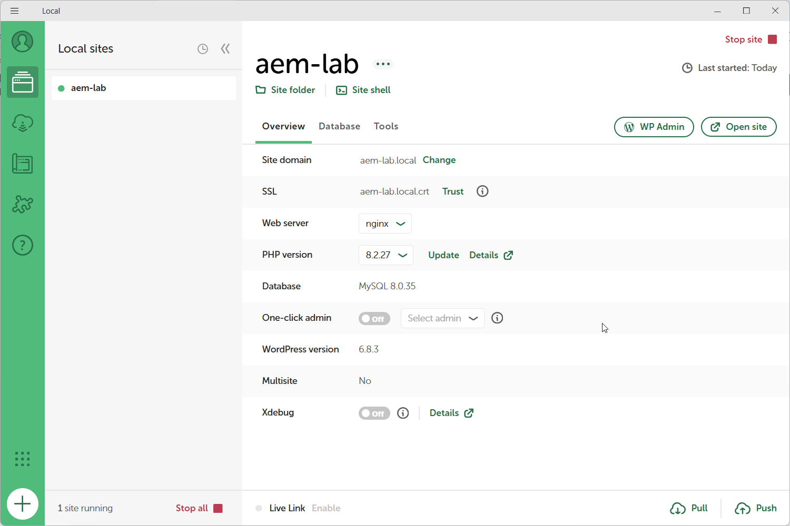
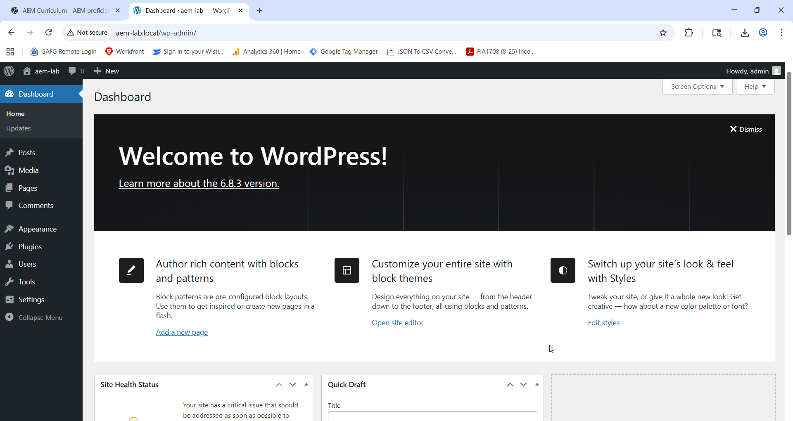
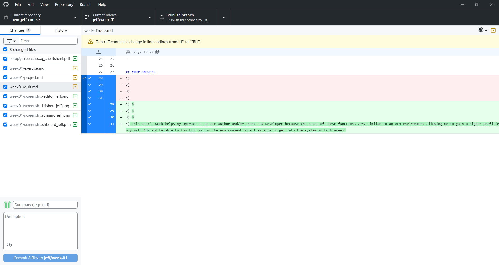
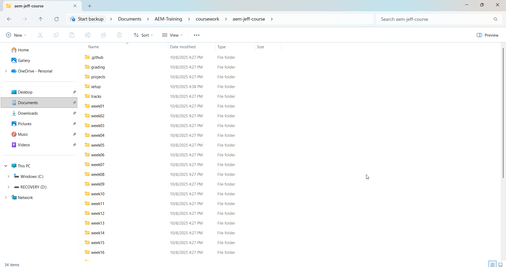

# Week 01 — Project Milestone: Environment Setup

## 1. Environment Summary

 - Operating System: Windows 11
 - LocalWP Version: 8.2.27
 - WordPress Version: 6.8.3
 - Node.js Version: v22.20.0
 - Site Name: aem-lab
 - GitHub Repository: [https://github.com/Silentshadow64/aem-jeff-course](https://github.com/Silentshadow64/aem-jeff-course)

## 2. Folder Structure

C:.
|   .gitignore
|   folder-structure.txt
|   PROFESSOR_GUIDE.md
|   README.md
|   TA_GUIDE.md
|   
+---.github
|   \---ISSUE_TEMPLATE
|           ready_for_grading.yml
|           request_ta_help.yml
|           
+---grading
|       gradebook.xlsx
|       
+---projects
|   \---capstone
|           README.md
|           
+---setup
|       screenshot_naming_cheatsheet.pdf
|       Setup_Guide.md
|       
+---tracks
|       creative.md
|       technical.md
|       
+---week01
|   |   exercise.md
|   |   project.md
|   |   quiz.md
|   |   README.md
|   |   rubric.md
|   |   submission.md
|   |   
|   \---screenshots
|           .gitkeep
|           week01_exercise_aboutus-editor_jeff.png
|           week01_exercise_aboutus-published_jeff.png
|           week01_project_github-commit_jeff.png
|           week01_project_localwp-running_jeff.png
|           week01_project_wpadmin-dashboard_jeff.png
|           
+---week02
|   |   exercise.md
|   |   project.md
|   |   quiz.md
|   |   README.md
|   |   rubric.md
|   |   submission.md
|   |   
|   \---screenshots
|           .gitkeep
|           
+---week03
|   |   exercise.md
|   |   project.md
|   |   quiz.md
|   |   README.md
|   |   rubric.md
|   |   submission.md
|   |   
|   \---screenshots
|           .gitkeep
|           
+---week04
|   |   exercise.md
|   |   project.md
|   |   quiz.md
|   |   README.md
|   |   rubric.md
|   |   submission.md
|   |   
|   \---screenshots
|           .gitkeep
|           
+---week05
|   |   exercise.md
|   |   project.md
|   |   quiz.md
|   |   README.md
|   |   rubric.md
|   |   submission.md
|   |   
|   \---screenshots
|           .gitkeep
|           
+---week06
|   |   exercise.md
|   |   project.md
|   |   quiz.md
|   |   README.md
|   |   rubric.md
|   |   submission.md
|   |   
|   \---screenshots
|           .gitkeep
|           
+---week07
|   |   exercise.md
|   |   project.md
|   |   quiz.md
|   |   README.md
|   |   rubric.md
|   |   submission.md
|   |   
|   \---screenshots
|           .gitkeep
|           
+---week08
|   |   exercise.md
|   |   project.md
|   |   quiz.md
|   |   README.md
|   |   rubric.md
|   |   submission.md
|   |   
|   \---screenshots
|           .gitkeep
|           
+---week09
|   |   exercise.md
|   |   project.md
|   |   quiz.md
|   |   README.md
|   |   rubric.md
|   |   submission.md
|   |   
|   \---screenshots
|           .gitkeep
|           
+---week10
|   |   exercise.md
|   |   project.md
|   |   quiz.md
|   |   README.md
|   |   rubric.md
|   |   submission.md
|   |   
|   \---screenshots
|           .gitkeep
|           
+---week11
|   |   exercise.md
|   |   project.md
|   |   quiz.md
|   |   README.md
|   |   rubric.md
|   |   submission.md
|   |   
|   \---screenshots
|           .gitkeep
|           
+---week12
|   |   exercise.md
|   |   project.md
|   |   quiz.md
|   |   README.md
|   |   rubric.md
|   |   submission.md
|   |   
|   \---screenshots
|           .gitkeep
|           
+---week13
|   |   exercise.md
|   |   project.md
|   |   quiz.md
|   |   README.md
|   |   rubric.md
|   |   submission.md
|   |   
|   \---screenshots
|           .gitkeep
|           
+---week14
|   |   exercise.md
|   |   project.md
|   |   quiz.md
|   |   README.md
|   |   rubric.md
|   |   submission.md
|   |   
|   \---screenshots
|           .gitkeep
|           
+---week15
|   |   exercise.md
|   |   project.md
|   |   quiz.md
|   |   README.md
|   |   rubric.md
|   |   submission.md
|   |   
|   \---screenshots
|           .gitkeep
|           
+---week16
|   |   exercise.md
|   |   project.md
|   |   quiz.md
|   |   README.md
|   |   rubric.md
|   |   submission.md
|   |   
|   \---screenshots
|           .gitkeep
|           
+---week17
|   |   exercise.md
|   |   project.md
|   |   quiz.md
|   |   README.md
|   |   rubric.md
|   |   submission.md
|   |   
|   \---screenshots
|           .gitkeep
|           
+---week18
|   |   exercise.md
|   |   project.md
|   |   quiz.md
|   |   README.md
|   |   rubric.md
|   |   submission.md
|   |   
|   \---screenshots
|           .gitkeep
|           
+---week19
|   |   exercise.md
|   |   project.md
|   |   quiz.md
|   |   README.md
|   |   rubric.md
|   |   submission.md
|   |   
|   \---screenshots
|           .gitkeep
|           
+---week20
|   |   exercise.md
|   |   project.md
|   |   quiz.md
|   |   README.md
|   |   rubric.md
|   |   submission.md
|   |   
|   \---screenshots
|           .gitkeep
|           
+---week21
|   |   exercise.md
|   |   project.md
|   |   quiz.md
|   |   README.md
|   |   rubric.md
|   |   submission.md
|   |   
|   \---screenshots
|           .gitkeep
|           
+---week22
|   |   exercise.md
|   |   project.md
|   |   quiz.md
|   |   README.md
|   |   rubric.md
|   |   submission.md
|   |   
|   \---screenshots
|           .gitkeep
|           
+---week23
|   |   exercise.md
|   |   project.md
|   |   quiz.md
|   |   README.md
|   |   rubric.md
|   |   submission.md
|   |   
|   \---screenshots
|           .gitkeep
|           
\---week24
    |   exercise.md
    |   project.md
    |   quiz.md
    |   README.md
    |   rubric.md
    |   submission.md
    |   
    \---screenshots
            .gitkeep
 

## 3. Verification Screenshots

### LocalWP Running

### WordPress Admin Dashboard

### GitHub Commit History

### Folder Structure (Optional)

## 4. Reflection        

Setting up LocalWP and GitHub went smoothly after adjusting my PATH variables. 
Initially, GitHub Desktop could not detect the repo folder; I fixed this by moving the unzipped course files into the cloned directory.
LocalWP started correctly, and I was able to log into WordPress Admin using admin/Admin123!.
Next time I'll pay closer attention to screenshot naming conventions to save cleanup time before grading.